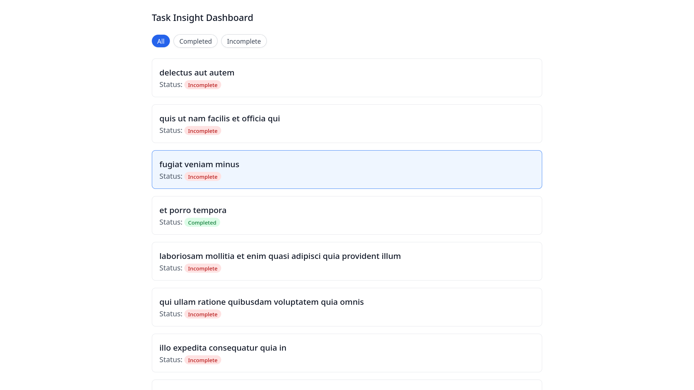

# Task Insight Dashboard
A React dashboard for viewing and filtering tasks, with persistent filter selection and a responsive layout.

## Motivation
My motivation was to build a React app from the ground up, practicing reusable component design, React workflows, and Tailwind CSS styling. This project helped strengthen my front-end development skills through a small but complete application.

## Features
- Fetches a list of tasks from a public example API for developers.
- Filter tasks by completion status (All / Completed / Incomplete).
- Persist the selected task filter across page reloads using localStorage.
- Responsive layout that adapts to different screen sizes using Tailwind CSS.

## Tech Stack
- React (Functional Components, Hooks)
- JavaScript (ES6+)
- HTML5 & CSS3
- Tailwind CSS
- LocalStorage for state persistence
- Fetch API for retrieving tasks
- Vitest & React Testing Library for testing

## Project Structure
- `src/components/` – contains components like `TaskFilter`, `TaskCard`, and `TaskList`
- `src/tests/` – global test setup (`setup.js`)
- `App.jsx` – root component
- `App.test.jsx` – main test suite for the App component
- `main.jsx` – application entry point

## Demo
Check out the live demo: [Task Insight Dashboard Live](https://task-insight-dashboard.netlify.app/)

*Responsive layout adapts to different screen sizes.*

## Installation

### Prerequisites
- Node.js 22.20  
  (Recommended: install via [nvm](https://github.com/nvm-sh/nvm))

### Steps
1. Clone the repo: `git clone https://github.com/khanm3/task-insight-dashboard.git`
2. `cd task-insight-dashboard`
3. Use the correct Node version: `nvm use`
4. Install dependencies: `npm install`
5. Start the app: `npm run dev`

## Running Tests
- Run all tests: `npm test`
- Includes tests for task filter functionality and persistence across page reloads.
- One feature (task filter persistence) was developed using Test-Driven Development (TDD) principles.

## Usage
- Click on a task to select it (the selected task is visually highlighted).
- Change the task filter (All / Completed / Incomplete).
- Reload the page — your selected filter will persist.

## Key Learnings
- Improved my understanding of React Hooks and effective state management in functional components.
- Learned how to persist UI state across page reloads using localStorage.
- Gained experience designing responsive layouts with Tailwind CSS and applying utility-first styling principles.
- Strengthened skills in writing reliable tests with Vitest and React Testing Library, and learned how to apply TDD to guide development.

## Future Improvements
- Add, edit, and delete tasks to implement full CRUD functionality using React and localStorage.
- Enable custom statuses and priorities for tasks, expanding filtering options.
- Optionally, integrate with a backend API in the future for cloud persistence.
