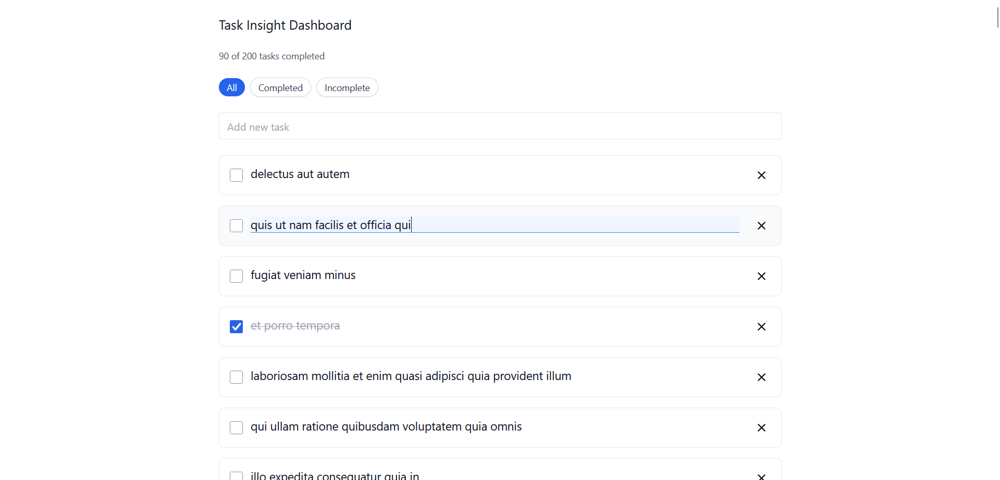

# Task Insight Dashboard

React • TypeScript • Tailwind CSS • Vitest • React Testing Library

A responsive task management dashboard built with **React, TypeScript, and Tailwind CSS**.
The application allows users to add, edit, delete, and filter tasks while tracking completion progress in a clean, accessible interface.

**Live Demo:**
https://task-insight-dashboard.netlify.app/



*Responsive layout adapts to different screen sizes.*

## Features

* Fetches an initial list of tasks from a public example API for developers.
* Add new tasks.
* Edit task titles inline.
* Delete tasks.
* Toggle task completion.
* Filter tasks by completion status (All / Completed / Incomplete).
* Persist the selected task filter across page reloads using `localStorage`.
* Responsive layout that adapts to different screen sizes using Tailwind CSS.
* Accessible UI using ARIA attributes.
## Tech Stack

### Frontend

* **React** (Functional Components, Hooks)
* **TypeScript**
* **Vite**

### Styling

* **Tailwind CSS**

### Testing

* **Vitest**
* **React Testing Library**

### Data & APIs

* **Fetch API**
* **JSONPlaceholder API** *(used to load example tasks on initial app load)*

### Browser Storage

* **LocalStorage** for persisting UI state

## Motivation

My goal with this project was to build a React application from the ground up while practicing **component-based architecture, modern React workflows, and utility-first styling with Tailwind CSS**.

As the project evolved, I expanded it by adding **TypeScript for type safety**, implementing **CRUD functionality**, and strengthening the codebase with **testing using Vitest and React Testing Library**.

This project represents a small but complete front-end application that demonstrates modern React development practices.

## Project Structure

* `src/components/` – reusable UI components (`TaskCard`, `TaskList`, `TaskFilter`, `AddTask`)
* `src/types.ts` – shared TypeScript types and domain models
* `src/tests/` – test setup and test utilities
* `App.tsx` – root application component
* `App.test.jsx` – main test suite for the App component
* `main.tsx` – application entry point

## Installation

### Prerequisites

* Node.js 22.20
  (Recommended: install via [nvm](https://github.com/nvm-sh/nvm))

### Steps

1. Clone the repository:

```
git clone https://github.com/khanm3/task-insight-dashboard.git
```

2. Navigate to the project directory:

```
cd task-insight-dashboard
```

3. Use the correct Node version:

```
nvm use
```

4. Install dependencies:

```
npm install
```

5. Start the development server:

```
npm run dev
```

## Testing

Run the test suite:

```
npm test
```

The project includes a comprehensive test suite built with **Vitest** and **React Testing Library**.

Most features in the application were developed using **Test-Driven Development (TDD)**. Tests were written first to define expected behavior, followed by implementation to satisfy those tests.

### What the tests cover

The test suite verifies key application behaviors including:

* Rendering of the dashboard UI
* Fetching and displaying tasks from the API
* Task filtering (All / Completed / Incomplete)
* Filter persistence using `localStorage`
* Task completion toggling
* Inline task editing (Enter, Escape, blur behaviors)
* Switching edit focus between tasks
* Task deletion
* Task creation with input validation

### Testing approach

Tests are written from a **user interaction perspective**, following recommended practices from React Testing Library:

* Queries prioritize accessible roles (`getByRole`, `findByRole`)
* User interactions are simulated with `userEvent`
* External APIs are mocked to isolate application logic
* Preconditions, user actions, and postconditions are explicitly verified

This approach ensures that tests validate **real user behavior rather than implementation details**, making the test suite more resilient to refactoring.

## Usage

* Add new tasks using the task input field.
* Toggle task completion using the checkbox.
* Edit task titles inline.
* Delete tasks from the list.
* Filter tasks by completion status (All / Completed / Incomplete).
* Reload the page — the selected filter will persist.

## Key Learnings

* Strengthened understanding of **React Hooks and state management** in functional components.
* Learned how to **persist UI state using localStorage**.
* Implemented **type-safe frontend architecture using TypeScript**.
* Gained experience designing **responsive layouts with Tailwind CSS**.
* Improved testing skills with **Vitest and React Testing Library**.
* Practiced structuring a small application using **reusable components and typed domain models**.

## Future Improvements

* Persist tasks using a backend API instead of in-memory state.
* Add drag-and-drop task ordering.
* Improve test coverage across additional components.
* Implement dark mode.
* Extract task logic into custom React hooks.

## Author

Built by **Mohammad Khan** as part of a front-end development portfolio.
